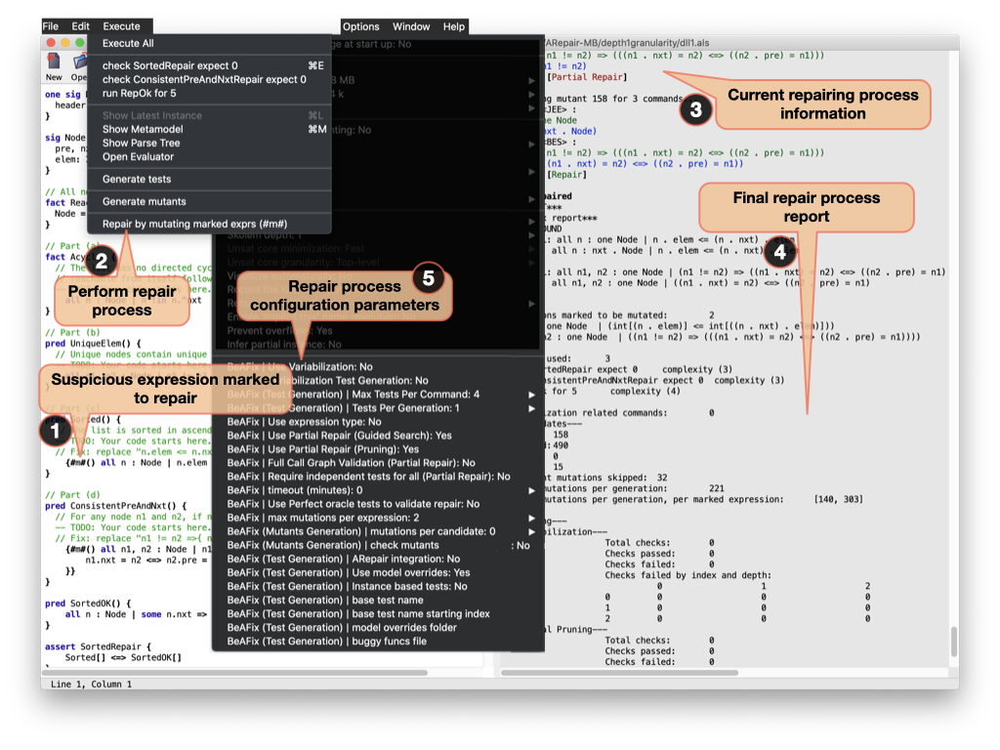

# BeAFix (submission for Artifact Evaluation at ICSE 2021)

### BeAFix: Bounded Exhaustive Search of Alloy Specification Repairs

[comment]: <> (*Simón Emmanuel Gutiérrez Brida, Germán Regis, Guolong Zheng, Hamid Bagheri, Thanhvu Nguyen, Nazareno Aguirre and Marcelo Frias*)

## Artifact Description

BeAFix is an automated repair technique for faulty models written in Alloy, a declarative language based on first-order relational logic. BeAFix is backed with a novel strategy for bounded exhaustive, yet scalable, exploration of the spaces of fix candidates and a formally rigorous, sound pruning of such spaces. Moreover, different from the state-of-the-art in Alloy automated repair, that relies on the availability of unit tests, BeAFix does not require tests and can work with assertions that are naturally used in declarative languages. 

BeAFix provides two ways of usage: 
* A *Command-Line* interface, more suitable to perform batch repairs or to use it in a pipeline with other tools and techniques.
* A *Graphical User Interface*, that extends Alloy Analyzer, allowing users to launch Alloy repairs using an interface that is more natural for Alloy users, with  real-time information about the repair process. 

## Getting and Installing BeAFix
BeAFix can be obtained by downloading the correponding jar files (Command-Line or GUI Interfaces) to run the tool natively. Alternatively, users can also interact with the tool using Docker, as we provide a container with the replication package scripts and case studies. Detailed information about the installation can be found in [INSTALL.md](INSTALL.md).

## Using BeAFix

### Command-Line Interface

To run the CLI version you need the corresponding jar file (the one that has CLI in the name). Executing `java -jar <BeAFixCLI jar> --help` you can get all the options on how to run the tool.

### Graphical User Interface

The GUI version of BeAFix is an extension of the Alloy Analyzer. The following image shows the features that BeAFix provides.

In order to attempt to repair a faulty alloy specification using BeAFix, the user needs to:
1. Mark the suspicious expressions (there can be more than one). A marked expression has the form `{#m#([vars]) expression}` where vars is a comma separated list of variables related to the marked expression (used by the variabilization pruning technique). As an example, consider the following marked expressions:

   * `{#m#() some x : T | P[x]}` where the whole quantifier expression is marked for mutation.

   * `some x : T | {#m#(x) P[x]}` where only a part of an expression is marked for mutation.

2. At the **Execute** menu, the **Repair** option is displayed and should be selected to start the repair process.

3. During the repair process, at the right-hand side panel, BeAFix shows information about the current state, namely: mutated expressions (original and mutated) with its corresponding [mutation operator](APPENDIX.md#mutation-operators), and a the result of evaluating that candidate.

4. Finally, a detailed report of the process is shown, including, if found, the fixed specification file.
   * _The repaired candidate is shown with the mutations used, the repaired specification file may contain redundant parentheses and other issues, since the candidate writer is simple_

5. Aditionally, at the **Option** menu, the user can set a particular configuration for BeAFix. Details of the configuration options can be found [here](APPENDIX.md#-beafix-gui-configuration-options).

## Reproducing the paper experiments

### Benchmarks
This replication package contains the benchmarks used in the paper. These can all be found in the benchmarks folder.

* **A4F-1B**: 1936 models from the Alloy4Fun benchmark , each having one bug.

* **A4F-MB**: 273 models derived from the Alloy4Fun benchmark , each having multiple bugs.

* **ARepair-1B**: 16 models from the ARepair benchmark , each having one bug.

* **ARepair-MB**: 15 models from the ARepair benchmark , each having multiple bugs.

* **depth1granularity**: the 15 models have the faulty expression marked at the "line" level.

* **depth2granularity**: 13 of the 15 models with the faulty expression marked with one more level inside of the original expression. For example, if the expression marked at line level was c in (a + b), and the fault is in b then the marked expression would be a + b.

* **depth3granularity**: 5 of the 13 models with the faulty expression marked with one more level.

* **depth4granularity**: 3 of the 5 models with the faulty expression marked with one more level.

_granularity did not have a significant impact on reparability_

### Running the experiments

BeAFix is in active development. For consistency (especially in running times), the experiments in the paper should be reproduced using the same version we used at the time of the submission (subsequent versions of the tool are also available, with some optimizations that make running times to be reduced with respect to those in the paper, for the same experiments).

To run the dockerized version of the tool, the command is `docker run -it drstein/beafix:2.1.2`. Inside the folder containing the replication package, the following command should be executed:

`./runBeAFix.sh BeAFixCLI-2.1.2.jar <path to case study> <depth> <pruning> <timeout> <results folder>.`

where **path to case study** is the full path to an *.als* file inside the benchmarks folder; **depth** is how many combinations of mutations to apply to each buggy expression; **pruning** *enables (1)* or *disables (0)* the use of pruning techniques; **timeout** (in minutes) states how much time is alloted to find a fix. The script adds 5 extra minutes to forcefully terminate BeAFix if it did not finish by itself in the allotted timeout; and **results folder** is where results will be stored (if the folder does not exist, it will be created, but if it exists it should be empty).

In our experiments we used depth 2 to 5 (only running cases with an increased depth for cases that were not repaired), and we used 60 minutes as timeout. The user is welcome to run all the experiments presented in the paper. Notice however that running all the experiments is costly, due to the large number of different case studies. 

### Output information details

After running an experiment, the results folder defined when calling the BeAFix script will contain the following:

* `<model's name>.summary` a sequence of values separated with `;` that starts with the model's name, followed by:
  * **TO from script** if BeAFix didn't end in the allotted time and was finished by the script. In this case no other value will be present in the summary.
  * **FAILED WITH CODE** followed by an exit code, if an error occurred. In this case no other value will be present in the summary.
  * **repaired (true/false)** stating if BeAFix was able to find a fix or not. 
  * **time (ms)** the running time of BeAFix.
  * **spuriosity (real/spurious)** a check only done when having a model with oracles that will only be used to validate a fix (none of our experiments use this) this will always be real for this replication package.
  * **the repair** as the modifications done by BeAFix to repair the model (separated by the symbol £).
  * **repair verification** this last value was only used as a debug helper and should be ignored.
* `<model's name>_repair.als` a repaired model (if a repair was found). 
* `<model's name>_repair.verification` a side product of the last verification process.
* `<model's name>_summaryLog.log` if BeAFix ended with an error code, this file contains the last 300 lines of some log files generated by BeAFix. These log files are deleted by the `cleanFiles` function in `runBeAFix.sh`, you can avoid this cleaning by comenting the `cleanFiles "$scase"` line.

#### Running the experiments per cases
To run all the cases, all Alloy4Fun 2 bugs classroom cases for example, the following command can be used:

`find benchmarks/A4F-MB | awk '/Classroom/' | xargs -I {} ./runBeAFix.sh BeAFixCLI-2.1.2.jar {} <depth> <pruning> <timeout> <results folder>`

Be adviced that, depending on the set of cases being run, running the tool in this batch mode for multiple case studies at once can be very time consuming, as the total number of case studies is rather large. We also recommend using meaningful and separate results folder for each run, depth, and pruning configuration. We give a list of commands for each case and pruning configuration using depth 2:

**Alloy4Fun 1 bug cases**

`find benchmarks/A4F-1B | awk '/\.als/' | xargs -I {} ./runBeAFix.sh BeAFixCLI-2.1.2.jar {} <depth> <pruning> <timeout> <results folder>`

**Alloy4Fun 2 bugs cases**

*Classroom*:

`find benchmarks/A4F-MB | awk '/Classroom/' | xargs -I {} ./runBeAFix.sh BeAFixCLI-2.1.2.jar {} 2 0 60 CLASSROOM-2B-NOPRUNING-DEPTH2`

`find benchmarks/A4F-MB | awk '/Classroom/' | xargs -I {} ./runBeAFix.sh BeAFixCLI-2.1.2.jar {} 2 1 60 CLASSROOM-2B-PRUNING-DEPTH2`

*CV*

`find benchmarks/A4F-MB | awk '/CV_/' | xargs -I {} ./runBeAFix.sh BeAFixCLI-2.1.2.jar {} 2 0 60 CV-2B-NOPRUNING-DEPTH2`

`find benchmarks/A4F-MB | awk '/CV_/' | xargs -I {} ./runBeAFix.sh BeAFixCLI-2.1.2.jar {} 2 1 60 CV-2B-PRUNING-DEPTH2`

*Graphs*

`find benchmarks/A4F-MB | awk '/Graphs_/' | xargs -I {} ./runBeAFix.sh BeAFixCLI-2.1.2.jar {} 2 0 60 GRAPHS-2B-NOPRUNING-DEPTH2`

`find benchmarks/A4F-MB | awk '/Graphs_/' | xargs -I {} ./runBeAFix.sh BeAFixCLI-2.1.2.jar {} 2 1 60 GRAPHS-2B-PRUNING-DEPTH2`

*LTS*

`find benchmarks/A4F-MB | awk '/LTS_/' | xargs -I {} ./runBeAFix.sh BeAFixCLI-2.1.2.jar {} 2 0 60 LTS-2B-NOPRUNING-DEPTH2`

`find benchmarks/A4F-MB | awk '/LTS_/' | xargs -I {} ./runBeAFix.sh BeAFixCLI-2.1.2.jar {} 2 1 60 LTS-2B-PRUNING-DEPTH2`

*Production*

`find benchmarks/A4F-MB | awk '/Production_/' | xargs -I {} ./runBeAFix.sh BeAFixCLI-2.1.2.jar {} 2 0 60 PRODUCTION-2B-NOPRUNING-DEPTH2`

`find benchmarks/A4F-MB | awk '/Production_/' | xargs -I {} ./runBeAFix.sh BeAFixCLI-2.1.2.jar {} 2 1 60 PRODUCTION-2B-PRUNING-DEPTH2`

*Trash*

`find benchmarks/A4F-MB | awk '/Trash/' | xargs -I {} ./runBeAFix.sh BeAFixCLI-2.1.2.jar {} 2 0 60 TRASH-2B-NOPRUNING-DEPTH2`

`find benchmarks/A4F-MB | awk '/Trash/' | xargs -I {} ./runBeAFix.sh BeAFixCLI-2.1.2.jar {} 2 1 60 TRASH-2B-PRUNING-DEPTH2`

**ARepair 1 bug**

`find benchmarks/ARepair-1B | awk '/\.als/' | xargs -I {} ./runBeAFix.sh BeAFixCLI-2.1.2.jar {} 2 0 60 AREPAIR-1B-DEPTH2`

**ARepair multiple bugs**

`find benchmarks/ARepair-MB/depth1granularity | awk '/\.als/' | xargs -I {} ./runBeAFix.sh BeAFixCLI-2.1.2.jar {} 2 0 60 AREPAIR-2B-GRAN1-DEPTH2`

#### Merging summaries and running next depth experiments

Assuming a results folder (called results-depth2 for simplicity), Graphs 2 bugs cases, and pruning:

* Merging : `find results-depth2 | awk '/\.summary$/' | xargs -I {} cat {} >> results.summary`
* Obtaining cases not repaired: `cat results.summary | grep -v '^.*; true' | sed 's|;.*$||g' >> notRepaired`
* Running next depth: `cat notRepaired | xargs -I {} ./runBeAFix.sh BeAFixCLI-2.1.2.jar benchmarks/A4F-MB/{}.als 3 1 60 GRAPHS-2B-PRUNING-DEPTH3`
